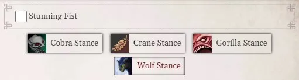
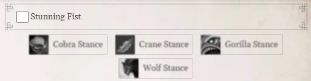
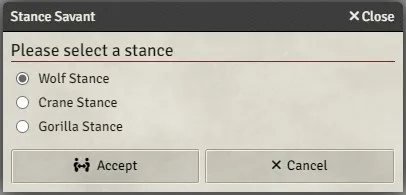

# FoundryVTT PF2e Stances

This module will help players manage their character's stances (only stances which originate from feats will be handled).



A new section displaying your stances will be added at the top of the action tab of the character sheet.

Clicking on a stance will add its effect to the character while removing all other stance effects currently existing.



The stances will not be normally available if the character is not part of an encounter, but a user can still force the stance by using `ctrl+click`.

When leaving an encounter, the stance effects will be removed from the character automatically.

If a feat override a stance in the system, the upgraded version of the stance effect will be used instead (i.e. if the character has both `Gorilla Stance` and `Gorilla Pound` feats, the effect of the later will be used but the name of the stance in the tab will still be `Gorilla Stance`).

New effects have been added for all the stances that didn't have one in the system for convenience.

# Stance Savant



The module will handle `Stance Savant` by automatically entering a stance if only one exist on the character or open a window asking to select one when the character joins a new encounter.

# Custom Stances

You can register your own combos of `feat` + `effect` in the settings. To do so, you need to provide a valid JSON array of objects with a `feat` and `effect` keys containing their respective UUIDs.

    [{ "feat": "Compendium.pf2e.feats-srd.Item.AN9jY1JVcU20Qdw6", "effect": "Compendium.pf2e.feat-effects.Item.b2kWJuCPj1rDMdwz" }]

# API

A set of functions is exposed from the module to be used by third parties:

```js
/**
 * Retrieves the API object containing the funtions
 */
game.modules.get('pf2e-stances').api
```

```js
/**
 * @param {CharacterPF2e} actor
 * @returns {Array<{ name: string; img: string; effectUUID: ItemUUID; effectID: string }>} the stances on the actor
 */
getStances: (actor: CharacterPF2e) => { name: string; img: string; effectUUID: ItemUUID; effectID: string }[]
```

```js
/**
 * @returns {Set<ItemUUID>} a set of stance related actions UUIDs
 */
getActionsUUIDS: () => Set<ItemUUID>
```

```js
/**
 * Toggles a stance on the actor
 * @param {CharacterPF2e} actor
 * @param {ItemUUID} effectUUID - the stance effect uuid
 * @returns {Promise<void>}
 */
toggleStance: (actor: CharacterPF2e, effectUUID: ItemUUID) => Promise<void>
```

# CHANGELOG

You can see the changelog [HERE](./CHANGELOG.md)
